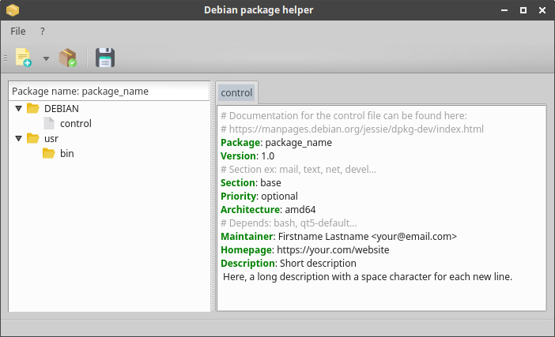

# debpac
A debian package creator assistant. 

## Development status

Features | State
------------ | -------------
Drag & Drop | 
Rename package name | 
Change package version | 
Add postinst/preinst script | 
Add postrm/prerm script | 
Add .desktop file | 
Syntaxic coloration for file editing | 
Reorganise tree | 
Type of file recognise by hex signature | 
Save package project | 
Restore package project | 
Generate package | 

First release progress 

### Current preview

## How to use (in coming)

...

## Example of use (in coming)
...

### Support development :+1:

Star the project :star:

### Credits

Icons | Author
------------ | -------------
binary file diskette generate add_script about credits import | Icon made by Freepik https://www.flaticon.com/authors/freepik
audio package image | Icon made by Buddhe https://www.flaticon.com/authors/pixel-buddha
archive | Icon made by Roundicons https://www.flaticon.com/authors/roundicons
folder | Icon made by Smashicons https://www.flaticon.com/authors/smashicons
desktop | Icon made by vectors Market https://www.flaticon.com/authors/vectors-market
